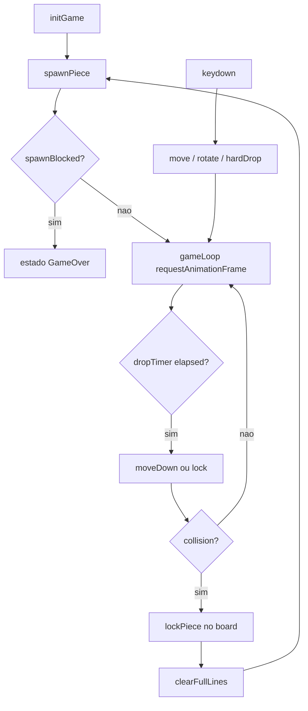

# Plano: Tetris básico no browser

O diretório [`/home/cecilia/Documents/prog-agentes/ativ2`](/home/cecilia/Documents/prog-agentes/ativ2) está vazio. A implementação será **greenfield**, em **JavaScript vanilla** (sem build step), usando **Canvas 2D** para o campo principal e um canvas menor para a próxima peça.

## Estrutura de arquivos proposta

```
ativ2/
├── index.html      # layout: canvas jogo + canvas próxima + instruções
├── css/style.css   # centralização, dimensões dos canvases
└── js/
    ├── constants.js   # dimensões, cores, teclas, velocidades
    ├── tetrominoes.js # definição dos 7 tipos + rotações
    ├── board.js       # grid, colisão, lock, clear lines, game over
    ├── piece.js       # peça ativa (posição, rotação, movimento)
    ├── renderer.js    # desenho do grid, células, ghost (opcional)
    └── game.js        # loop, input, spawn, estados (playing/gameover)
```

TypeScript é opcional; para a versão básica pedida, **JS modular** (`type="module"` no HTML) mantém o projeto simples de abrir com um servidor estático local (`python -m http.server` ou extensão Live Server).

## Modelo de dados

### Tabuleiro

- Matriz `board[rows][cols]` com `rows = 20`, `cols = 10`.
- Cada célula: `0` (vazia) ou índice/cor do tetraminó (1–7).
- Linhas **não visíveis** acima do topo (buffer de 2 linhas) são opcionais; para a versão básica, spawn no meio superior (`col` 3–4) com checagem de game over nas 4 células do spawn.

### Tetraminós (7 tipos)

| Tipo | Forma |
|------|--------|
| I | ████ |
| O | ██ / ██ |
| T, S, Z, J, L | formas clássicas 3×3 ou 4×4 |

Cada tipo armazenado como **matrizes de rotação** (0–3 estados) ou **forma base + função de rotação** (rotação no sentido horário com wall kicks simples: tentar deslocar ±1 coluna se a rotação colidir).

```javascript
// Exemplo conceitual em tetrominoes.js
const SHAPES = {
  I: [[[0,0,0,0],[1,1,1,1],...], /* rotações */],
  O: [[[1,1],[1,1]]], // O não gira na prática (ou 1 estado)
  // T, S, Z, J, L ...
};
const COLORS = { I: '#00f0f0', O: '#f0f000', ... };
```

**Bag aleatório (recomendado):** embaralhar os 7 tipos e consumir da fila; ao esvaziar, reembaralhar. Garante distribuição justa e simplifica “próxima peça”.

## Arquitetura e fluxo



## Elementos principais (como implementar)

### 1. Campo de jogo

- Canvas principal: `cols * cellSize` × `rows * cellSize` (ex.: célula 30px → 300×600).
- [`renderer.js`](js/renderer.js): desenhar grade de fundo, células preenchidas do `board`, e a peça ativa por cima.
- Borda visual opcional; lógica usa apenas índices 0..9 e 0..19.

### 2. Controles

| Tecla | Ação |
|-------|------|
| ← / → | mover ±1 coluna (se não colidir) |
| ↑ ou X | rotação horária |
| ↓ | soft drop (acelera queda: resetar timer de gravidade ou mover 1 linha imediatamente) |
| Espaço (opcional) | hard drop instantâneo até chão |

- `keydown` com `preventDefault()` para setas.
- **Repetição automática (DAS):** opcional na v1; pode usar intervalo simples após ~150ms segurando ←/→.

### 3. Queda com o tempo

- Variável `dropInterval` (ex. 800ms no início).
- Acumulador `dropAccumulator += deltaTime` no loop; quando `>= dropInterval`, chamar `moveDown()`.
- Soft drop (↓): diminuir intervalo temporariamente ou mover a cada frame enquanto pressionado.

### 4. Detecção de colisão

Função central reutilizada por movimento, rotação e gravidade:

```javascript
function collides(board, piece, row, col, rotation) {
  const shape = getShape(piece.type, rotation);
  for (cada célula 1 em shape)
    if fora dos limites OU board[r][c] !== 0 → true
  return false;
}
```

### 5. Fixar peça e limpar linhas

- Ao `moveDown()` colidir: copiar células da peça para `board`, limpar referência da peça ativa.
- `clearLines()`: percorrer linhas de baixo para cima; se linha cheia (`every cell !== 0`), remover e inserir linha vazia no topo.
- Pontuação simples (opcional): +100 × nº de linhas de uma vez.

### 6. Próxima peça

- Fila `nextPiece` (tipo) atualizada no spawn.
- Segundo canvas (ex. 4×4 células) em [`renderer.js`](js/renderer.js) desenhando `nextPiece` centralizado.
- No spawn: `current = next`, `next = pullFromBag()`.

### 7. Game over

Após escolher `current` e posição inicial `(startRow, startCol)`:

```javascript
if (collides(board, current, startRow, startCol, 0)) {
  state = 'gameover';
  // parar loop / mostrar mensagem no canvas ou DOM
}
```

Isso cobre o caso em que o meio superior já está bloqueado e não cabe nova peça.

## Loop de jogo

- `requestAnimationFrame` + `timestamp` para `deltaTime`.
- Estados: `'playing' | 'gameover'`. Tecla `R` ou botão “Reiniciar” zera `board`, bag e score.
- Pausa (`P`): opcional.

## UI mínima ([`index.html`](index.html))

- Canvas `#game`
- Canvas `#next` + rótulo “Próxima”
- Texto: pontuação, nível (opcional), “Game Over — pressione R”
- Bloco de instruções de teclas

## Ordem de implementação sugerida

1. **constants + tetrominoes** — matrizes e cores dos 7 tipos.
2. **board** — grid vazio, `collides`, `mergePiece`, `clearLines`, `isSpawnBlocked`.
3. **piece** — spawn, move, rotate com wall kick simples.
4. **renderer** — desenhar board + peça ativa; depois preview.
5. **game** — input, loop, gravidade, transição spawn → lock → clear → spawn.
6. **game over + reinício** — overlay e reset.
7. **Polish opcional** — ghost piece, linhas piscando antes de sumir, aumento gradual de velocidade.

## Critérios de aceite (checklist manual)

- [ ] 7 tipos aparecem aleatoriamente (bag ou RNG uniforme).
- [ ] Peça cai sozinha; ←/→ movem; ↑ gira; ↓ acelera.
- [ ] Não atravessa paredes nem blocos fixos.
- [ ] Linha cheia desaparece e blocos acima descem.
- [ ] Preview da próxima peça atualiza a cada spawn.
- [ ] Game over quando nova peça colide no spawn.
- [ ] Abre no browser sem erros no console (servir via HTTP por causa de ES modules).

## Decisões já assumidas (ajustáveis na execução)

- **JS vanilla + Canvas** (sem framework).
- **Sem pontuação elaborada / hold / níveis** na v1, a menos que queira incluir depois.
- **Rotação:** SRS completo não é necessário; wall kick de 1 célula resolve a maioria dos casos na versão básica.

Se preferir **TypeScript** ou **apenas DOM (divs)** em vez de Canvas, a mesma lógica em `board.js` / `piece.js` permanece; só muda `renderer.js`.
