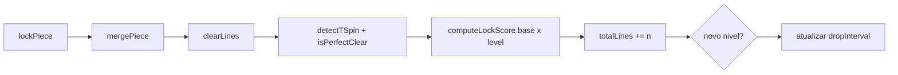

# Plano: Níveis e pontuação Tetris

## Estado atual

- Pontuação simplificada em [`js/game.js`](js/game.js): `lines * 100` no lock e `dropped * 2` no hard drop (sem nível).
- Gravidade fixa: `DROP_INTERVAL = 800` em [`js/constants.js`](js/constants.js).
- Sem detecção de T-spin, perfect clear ou back-to-back.
- UI só mostra pontuação em [`index.html`](index.html).

## Regras adotadas

| Regra | Valor |
|-------|--------|
| Subir de nível | A cada **10 linhas** limpas no total (`level = floor(totalLines / 10) + 1`, mínimo 1) |
| Pontos de lock | `pontuação_base × level` (conforme pedido) |
| Queda rápida / instantânea | `1 × level` e `2 × level` **por célula** percorrida |
| Perfect clear | Tabuleiro **totalmente vazio** após o clear; usa tabela própria (substitui single/double/triple/tetris normal) |
| Back-to-back (B2B) | Após Tetris (4 linhas) ou T-spin; na próxima jogada “difícil”, aplica bónus. **Perfect clear + Tetris + B2B** → base **3200** (em vez de 2000) |
| Velocidade | `dropInterval(level) = max(80, 800 × 0.85^(level-1))` ms (suave e previsível; ajustável em constantes) |



## Novo módulo: [`js/scoring.js`](js/scoring.js)

Centralizar tabelas e cálculo:

```javascript
// Bases (antes de × level)
export const SCORE = {
  line: { 1: 100, 2: 300, 3: 500, 4: 800 },
  tspinMini: { 0: 100, 1: 200 },
  tspin: { 1: 400, 2: 1200, 3: 1600 },
  perfectClear: { 1: 800, 2: 1200, 3: 1800, 4: 2000 },
  perfectClearTetrisB2B: 3200,
  softDropPerCell: 1,
  hardDropPerCell: 2,
};

export function computeLockScore({ lines, tSpin, perfectClear, backToBack, level }) { ... }
export function computeDropScore(cells, kind, level) { ... }
```

**Prioridade na lookup do lock** (uma única jogada):

1. Se `perfectClear` e `lines === 4` e `backToBack` → base `3200`
2. Senão se `perfectClear` → `SCORE.perfectClear[lines]`
3. Senão se `tSpin === 'mini'` → `SCORE.tspinMini[lines]` (0 ou 1 linha)
4. Senão se `tSpin === 'full'` → `SCORE.tspin[lines]` (1–3 linhas; 4 linhas raro)
5. Senão → `SCORE.line[lines]` (1–4)

Retorno: `{ points, isDifficult }` onde `isDifficult = lines===4 || tSpin !== 'none'` para atualizar flag B2B na jogada **seguinte**.

## Detecção de T-spin e perfect clear

### [`js/board.js`](js/board.js)

- `isBoardEmpty(board)` — após `clearLines`, verificar se todas as células são 0.
- `countFilledCorners(board, piece)` — para peça **T** no lock: localizar célula central do T (célula compartilhada das 3 pernas na rotação atual) e contar quantos dos **4 cantos diagonais** estão bloqueados (parede ou bloco fixo).

### [`js/piece.js`](js/piece.js)

Rastrear última ação para T-spin (regra guideline simplificada):

- `piece.lastAction`: `'none' | 'move' | 'rotate'` — reset no spawn; `move` em `movePiece`; `rotate` em `rotatePiece` bem-sucedido.
- `piece.lastKick`: colunas deslocadas no último giro (`kick !== 0`) para distinguir mini.

**Classificação no lock** (em `game.js` ou função em `board.js`):

- Só avaliar se `piece.type === 'T'` e `lastAction === 'rotate'`.
- `corners >= 3` → T-spin **full**
- `corners === 2` e `lastKick !== 0` → T-spin **mini**
- Caso contrário → sem T-spin

### Back-to-back

- Estado `backToBackReady` (boolean) em `game.js`.
- Após lock: se `isDifficult`, `backToBackReady = true`; se jogada atual usou B2B (`backToBackReady && difficult`), consumir flag; se jogada **não** foi difficult, `backToBackReady = false`.

Nota: B2B clássico usa multiplicador 1.5×; aqui o único valor explícito extra na tabela do utilizador é **3200** para perfect Tetris em sequência — os restantes casos B2B podem ficar só com a flag para esse caso (ou documentar como melhoria futura 1.5× em T-spin/Tetris).

## Níveis e velocidade

### [`js/constants.js`](js/constants.js)

- `LINES_PER_LEVEL = 10`
- `BASE_DROP_MS = 800`, `MIN_DROP_MS = 80`, `LEVEL_SPEED_FACTOR = 0.85`
- `getDropInterval(level)` e `getLevelFromLines(totalLines)`
- Remover `SCORE_PER_LINE` (obsoleto)

### [`js/game.js`](js/game.js)

Estado novo:

```javascript
let level = 1;
let totalLines = 0;
let backToBackReady = false;
```

Em `lockPiece()`:

1. Guardar contexto da peça (tipo, `lastAction`, `lastKick`) **antes** de `mergePiece`.
2. `mergePiece` → `lines = clearLines` → `perfectClear = isBoardEmpty(board)`.
3. `tSpin = classifyTSpin(board, pieceSnapshot)` se aplicável.
4. `points = computeLockScore({ lines, tSpin, perfectClear, backToBack: backToBackReady && isDifficultType(...), level })`.
5. `totalLines += lines`; recalcular `level`; atualizar `backToBackReady`.
6. Atualizar DOM (`score`, `level`, `lines`).

Gravidade no loop:

```javascript
const interval = keysDown.has('ArrowDown')
  ? SOFT_DROP_INTERVAL
  : getDropInterval(level);
```

**Soft drop:** em cada `movePiece` vertical bem-sucedido via ↓ (e opcionalmente no `handleInput`), somar `computeDropScore(1, 'soft', level)`.

**Hard drop:** substituir `dropped * 2` por `computeDropScore(dropped, 'hard', level)` em [`js/game.js`](js/game.js) (keydown Space).

## UI

### [`index.html`](index.html)

No painel `stats`:

```html
<p>Nível: <span id="level">1</span></p>
<p>Linhas: <span id="lines">0</span></p>
<p>Pontuação: <span id="score">0</span></p>
```

### [`js/game.js`](js/game.js)

Função `updateHUD()` chamada após pontuar e no `initGame()`.

### [`README.md`](README.md)

Documentar tabela de pontos (resumo), fórmula `base × nível`, 10 linhas por nível e T-spin/perfect clear.

## Ficheiros tocados

| Ficheiro | Alteração |
|----------|-----------|
| `js/scoring.js` | **Novo** — tabelas e funções de pontuação |
| `js/constants.js` | Níveis, velocidade, remover score antigo |
| `js/board.js` | `isBoardEmpty`, helpers T-spin |
| `js/piece.js` | `lastAction`, `lastKick` |
| `js/game.js` | Integrar nível, scoring, B2B, HUD |
| `index.html` | Campos nível e linhas |
| `css/style.css` | Ajuste menor no painel stats se necessário |
| `README.md` | Documentação |

**Sem alterações** em `renderer.js` / `tetrominoes.js` (salvo import indireto).

## Testes manuais sugeridos

- Limpar 10 linhas → nível 2 e queda visivelmente mais rápida.
- Single / double / triple / tetris → pontos = base × nível (ex.: single nível 3 = 300).
- Segurar ↓ → +1×nível por célula; Espaço → +2×nível por célula.
- T + rotação + lock com 3 cantos → T-spin; verificar bases 400/1200/1600 conforme linhas.
- Esvaziar o tabuleiro com clear → perfect clear (bases 800–2000).
- Game over / reinício (R) zeram nível, linhas e B2B.

## Limitações conscientes

- T-spin **mini** usa heurística 2 cantos + kick, não SRS completo (aceitável para versão didática).
- B2B além do caso 3200 não aplica 1.5× global — só o valor explícito da tabela do utilizador.
- Peça **O** nunca gera T-spin (correto).
