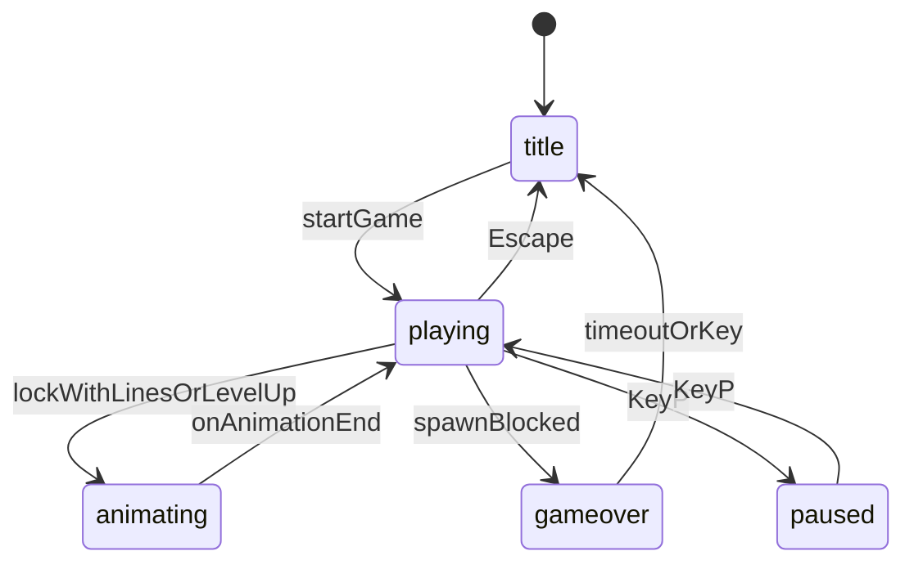

# Plano: Tema gatos, animações e áudio

## O que já existe

| Funcionalidade | Estado |
|----------------|--------|
| Game over + overlay canvas | Implementado em [`js/renderer.js`](js/renderer.js) |
| Menu / tela de abertura | `state: title` em [`js/game.js`](js/game.js) |
| High score + top 10 | [`js/highscore.js`](js/highscore.js) |
| Renderização | Retângulos coloridos via `COLORS` em [`js/constants.js`](js/constants.js) |
| Clear de linhas | Instantâneo em [`js/board.js`](js/board.js) `clearLines()` |

## Visão geral da arquitetura

Durante `animating`, a gravidade e o input ficam pausados; o `gameLoop` só atualiza animações e desenha.

---

## 1. Tema gatos (estética + blocos)

### Abordagem visual (prática, sem dependência de arte externa)

- Novo [`js/catSprites.js`](js/catSprites.js): desenhar **7 gatinhos cartoon** distintos em offscreen canvas (32×32), um por tipo `I,O,T,S,Z,J,L` — cores/caras/orelhas diferentes, mapeados a [`TYPE_INDEX`](js/constants.js).
- [`js/renderer.js`](js/renderer.js): substituir `drawCell` colorido por `drawCatCell(ctx, type, col, row, cellSize)` usando os sprites em cache.
- Fallback: se no futuro existirem PNG em `assets/cats/cat-{type}.png`, tentar carregar e usar imagem; senão, Canvas.

### Tema global (HTML/CSS)

- [`css/style.css`](css/style.css): paleta quente (creme `#fff5e6`, rosa `#ffb7c5`, marrom suave), painéis com bordas arredondadas, sombra leve, padrão de patinhas no `body` (CSS `background-image` repetido ou pseudo-elemento).
- [`index.html`](index.html): título **"Catris"** (ou subtítulo “Tetris dos Gatos”), fonte Google **Fredoka** ou **Nunito**.
- Overlays canvas: textos temáticos (“Miau!” no level-up, “Game Over” com sublinha felina).
- [`js/renderer.js`](js/renderer.js): fundo do tabuleiro estilo “caixa de gato” (gradiente + grid suave), ghost piece como gatinho semi-transparente.

### Mapeamento peça → gato

| Peça | Gato (identidade visual) |
|------|--------------------------|
| I | Gato comprido (siamês) |
| O | Gato redondo (laranja) |
| T | Gato roxo com “T” nas orelhas |
| S | Gato verde olhos fechados |
| Z | Gato tigrado |
| J | Gato azul |
| L | Gato creme com mancha |

---

## 2. Animações

### Novo módulo [`js/animations.js`](js/animations.js)

Gerir fila de animações com `update(delta)` → `done` e callback `onComplete`.

| Animação | Gatilho | Duração ~ | Efeito |
|----------|---------|-----------|--------|
| `lineClear` | 1+ linhas completas no lock | 400–600 ms | Linhas piscam (flash branco/amarelo), gatinhos “saltam”, depois `clearLines` real |
| `levelUp` | `getLevelFromLines(totalLines)` aumentou | 1200 ms | Banner “Nível N!” + partículas/patinhas no canvas |
| `lock` (opcional) | Peça fixa sem linhas | 80 ms | Micro “squash” na célula de impacto (leve, não atrasa jogo) |

### Alterações em [`js/board.js`](js/board.js)

- `findFullRows(board)` → índices das linhas cheias **antes** de apagar.
- Manter `clearLines(board)`; ou `clearRows(board, rowIndices)` chamado **após** a animação.

### Alterações em [`js/game.js`](js/game.js)

Refatorar `lockPiece()`:

1. `mergePiece`
2. `fullRows = findFullRows(board)`
3. Se `fullRows.length > 0` → `setState('animating')`, enfileirar `lineClear` com rows; no fim executar clear real, pontuação, `spawnPiece`
4. Se subiu nível → enfileirar `levelUp` (pode encadear após line clear)
5. Se sem linhas → pontuação T-spin etc. e `spawnPiece` imediato

O renderer recebe contexto de animação: `activeAnimation`, `flashPhase`, `levelUpBanner` para desenhar frames intermediários sem alterar o `board` até o fim do flash.

### Partículas simples (opcional, leve)

- Em [`js/animations.js`](js/animations.js) ou [`js/particles.js`](js/particles.js): 10–20 “patinhas” ou corações ao level-up / tetris (4 linhas).

---

## 3. Trilha sonora e SFX

### Novo [`js/audio.js`](js/audio.js)

- `AudioManager` com:
  - **BGM** em loop (`HTMLAudioElement` ou `AudioBuffer` via Web Audio)
  - **SFX**: `lineClear`, `tetris` (4 linhas), `levelUp`, `lock`, `rotate`, `gameOver`, `menuSelect`
- `init()` após primeiro gesto do utilizador (clique/Enter no menu — requisito dos browsers).
- `setMuted(bool)` + persistência em `localStorage` (`tetris-muted`).
- Volume separado música / efeitos (constantes ou slider simples na UI).

### Assets de áudio

Criar pasta [`assets/audio/`](assets/audio/) com ficheiros curtos royalty-free (documentar fonte no README), por exemplo:

- `bgm.mp3` / `bgm.ogg` — loop calmo/cat-themed (~1–2 min)
- `line-clear.ogg`, `level-up.ogg`, `lock.ogg`, `game-over.ogg`

**Plano B** se não houver ficheiros no repo na primeira entrega: gerar beeps suaves com **Web Audio API** (`OscillatorNode`) para SFX e BGM minimal até substituir por MP3/OGG reais.

### Integração

| Evento | Som |
|--------|-----|
| `startGame()` | Inicia BGM (se não muted) |
| `showTitle()` | Para ou baixa BGM |
| Line clear anim start | `lineClear` / `tetris` se 4 linhas |
| Level up anim | `levelUp` |
| `lockPiece` sem linhas | `lock` |
| `enterGameOver()` | `gameOver` |

### UI

- Botão **Som on/off** no painel lateral ([`index.html`](index.html) + [`css/style.css`](css/style.css)), tecla **M** para mute.

---

## 4. Ficheiros a criar / alterar

| Ficheiro | Ação |
|----------|------|
| `js/catSprites.js` | **Novo** — gerar/cache 7 sprites |
| `js/animations.js` | **Novo** — fila e tipos de animação |
| `js/audio.js` | **Novo** — BGM + SFX |
| `js/board.js` | `findFullRows`, ajuste de clear |
| `js/renderer.js` | Gatos, fundo temático, desenho de animações |
| `js/game.js` | Estados `animating`, hooks áudio/animação |
| `js/constants.js` | Cores temáticas (opcional, manter TYPE_INDEX) |
| `css/style.css` | Tema gatos completo |
| `index.html` | Fonte, botão mute, título Catris |
| `assets/audio/*` | **Novo** — ficheiros OGG/MP3 (ou só README até obter) |
| `README.md` | Créditos de áudio, controlos M |

**Sem mudanças** na lógica de scoring, T-spin, níveis, high scores.

---

## 5. Ordem de implementação

1. `catSprites.js` + renderer com gatinhos + CSS tema
2. `board.findFullRows` + `animations.js` + integração `lockPiece` / game loop
3. `audio.js` + assets + mute + gancho nos eventos
4. Polish: partículas level-up, overlay “Miau!”, README

---

## 6. Critérios de aceite

- [ ] Cada tipo de peça mostra um gato visualmente distinto no tabuleiro e no preview “Próxima”.
- [ ] Ao completar linha(s), há animação visível antes das linhas sumirem; jogo não avança peça durante o flash.
- [ ] Ao passar de nível, banner/animação “Nível N” visível e SFX.
- [ ] Música de fundo durante a partida; SFX nos eventos principais; mute funcional.
- [ ] Menu, game over e HUD mantêm comportamento atual.
- [ ] Sem erros no console; áudio só inicia após interação do utilizador.

## Limitações

- Gatinhos em Canvas são cartoon simples (não fotorealistas); sprites PNG podem ser adicionados depois sem mudar a API de `drawCatCell`.
- Animações bloqueiam input por ~0,5–1,5 s no máximo por lock com linhas + level-up — aceitável para feedback claro.
